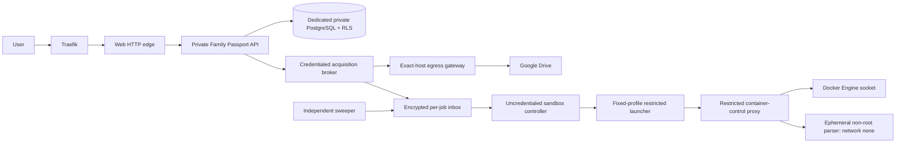

# Household Records Assistant architecture

> **Corrected revision 3 override (2026-08-19):** FP-004 rejected shared Supabase reuse. The normative [dedicated boundary revision](../../../software-factory/runs/family-passport-2026-08-17/technical-planning/architecture/dedicated-boundary-revision-3.md) now freezes a dedicated API/PostgreSQL, product-only backups, typed acquisition gateway, controller→launcher→restricted control-proxy mediation and ephemeral parser. Earlier shared-Supabase/revision-2 operational text is historical and `SUPERSEDED — DO NOT IMPLEMENT`. Pending independent re-review and disposable proof; not deployed.

LAST REVIEWED: 2026-08-19  
STATUS: REVISION 3 PROPOSED; independent security review and executable feasibility proof required

The MVP is planned as a modular API on a dedicated Family Passport PostgreSQL boundary with split acquisition, exact-host gateway, controller and ephemeral parser trust zones. It does not reuse the recorded Supabase/Bodycorp database. Google Drive retains only user-selected originals. The service stores sensitive derived text, facts, relationships, reminders, policies and provenance. It is therefore hybrid BYOS, not end-to-end encryption.

Only the web HTTP edge may join the shared proxy. The acquisition broker is the only routine component able to decrypt an owner-bound Drive token, has no direct Internet route and loads no parser; a typed application-layer gateway constructs registered requests and owns DNS, peer-IP, TLS, authority and redirect enforcement. The controller alone calls a fixed-schema launcher; the launcher alone reaches a restricted container-control proxy, and only that proxy holds the Engine socket. Every hostile parser runs one job non-root, read-only, capability-dropped and `network=none`, with no DB credential, secret, host/socket/device mount or inbound port. Per-job capabilities are single-use, hash/schema checked and independently purged.

PostgreSQL, OCR, workers and administration remain private. The dedicated product database has no PostgREST surface and no Supabase/Bodycorp role, schema, credential, network or backup relationship. Browser and routine workers cannot connect directly. Executor logins are `NOINHERIT NOBYPASSRLS`, own nothing, have no direct table rights and execute only allow-listed commands. Separate non-login owners, `FORCE RLS`, fixed `search_path=pg_catalog`, fully qualified functions, server-derived transaction-local context, pool clearing and deny-first defaults are mandatory. Cross-application network/credential denial and cross-family/private-adult tests fail closed; there is no shared-platform fallback.

All protected operations apply server authorization plus RLS. Household Owner/Admin roles do not reveal another adult’s private items; access requires ownership or an explicit grant. Search, counts, filenames, citations and reminders inherit the same policy, and authorization is checked before retrieval and again before response.

OCR is asynchronous and engine-neutral. Native text is preferred; OCR produces candidates with confidence and exact source evidence. Critical dates/identifiers become authoritative only after explicit adult confirmation. **D-038 selects PaddleOCR provisionally for the first self-hosted implementation lane**, behind a replaceable adapter; it is not a permanent production accuracy claim and must pass the minimum pre-beta acceptance set.

The MVP uses relational people/property/vehicle entities and typed relationship rows, PostgreSQL full-text search and a database-backed job/outbox queue. A graph database, vector search and generative assistant are deliberately deferred.

Google Picker receipts bind exact files to the connector owner. Moved, changed, revoked or deleted sources become truthful stale/unavailable states. Manual upload is an encrypted, non-backed-up transient copy, processed only after verified Drive write and purged within the stated 24-hour boundary. Export, deletion and revocation traverse all derived lineage; completion cannot be claimed before processor/live-store evidence and disclosed backup expiry.

**D-025 supersedes the earlier passkey MVP architecture; D-042 narrowly adds Google OIDC AAL1.** Verified email/password or exact-policy Google OIDC may create one AAL1 application session. Google identity is issuer+subject bound; email never auto-links, linking requires logged-in password+TOTP step-up, last-primary unlink is denied, and Google login/Drive tokens are separate. A new Google identity starts provisional with no household or role; local password, application-owned SHA-256 TOTP and recovery codes must commit atomically before household creation, with a notified cancellable 72-hour path after the 900-second first-session window. Recovery remains the externally-notified exact 72-hour fail-closed state machine. Passkeys are Phase 2. Complete `AUTH_TEST_MANIFEST.v3.json` is the standalone proposed authority and requires independent PASS before live execution.

The detailed normative pack is under `software-factory/runs/family-passport-2026-08-17/technical-planning/architecture/`: `architecture.md`, `adrs.md`, `data-model.md`, `api-contracts.md`, `threat-model.md`, `operational-requirements.md` and `rollback-assumptions.md`.

Key blockers before real-family beta include independent authorization/security testing, auth/recovery proof, exact image/SBOM promotion, public TLS/DNS, product monitoring and incident ownership, processor/privacy approval, off-host-backup risk decision, and application-level restore/deletion drills.
